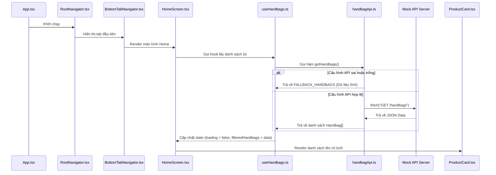
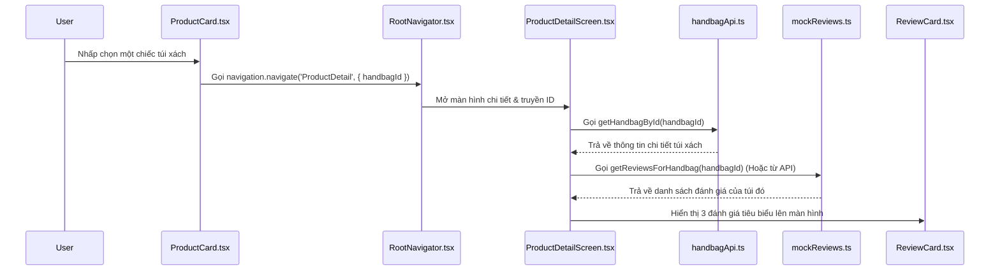
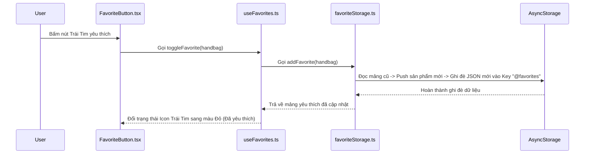
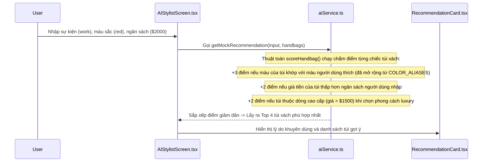
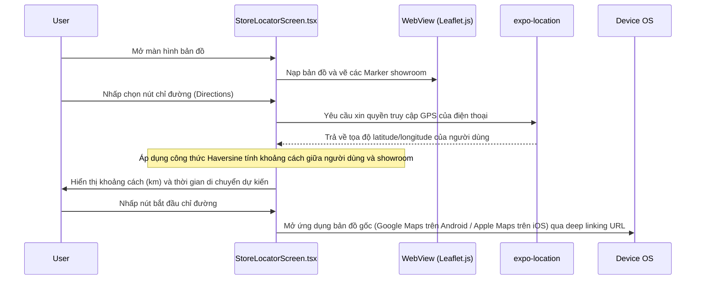

# 👜 Atelier — Luxury Handbag App (Tài Liệu Toàn Diện Cho Báo Cáo & Vibe Code)

Chào mừng bạn đến với **Atelier** — Ứng dụng di động cao cấp phục vụ nhu cầu tìm kiếm, khám phá và nhận gợi ý phong cách túi xách sang trọng. 

Tài liệu này được viết chi tiết từ A-Z với ngôn ngữ dễ hiểu, giúp các bạn "vibe code" hoặc newbie nắm bắt toàn bộ dự án từ tổng quan đến chi tiết, tự tin trả lời bất kỳ câu hỏi nào từ giảng viên khi vấn đáp đồ án.

---

## 🛠️ 1. Bản Đồ Công Nghệ (Technology Stack)

Để chạy được ứng dụng này, dự án kết hợp các công nghệ hiện đại trong thế giới React Native & Expo:

| Công nghệ | Khái niệm & Mục đích trong dự án | Tại sao giảng viên sẽ đánh giá cao? |
| :--- | :--- | :--- |
| **React Native (v0.83)** | Framework nguồn mở cho phép viết code bằng Javascript/React nhưng biên dịch ra các thành phần giao diện gốc (Native UI Components) của cả Android và iOS. | Giúp viết code một lần chạy được hai nền tảng, hiệu năng mượt mà hơn ứng dụng Web-view thuần túy. |
| **Expo (v55)** | Bộ công cụ và thư viện (Ecosystem) bọc quanh React Native. Nó cung cấp sẵn các API truy cập phần cứng (camera, định vị) và công cụ build cực nhanh. | Giúp lập trình viên không cần đụng vào code Java/Objective-C cấu hình phức tạp, phát triển cực nhanh qua Expo Go. |
| **TypeScript** | Phiên bản mở rộng của JavaScript bổ sung thêm tính năng khai báo kiểu dữ liệu (Type-safe). | Tránh lỗi gõ nhầm tên biến, tự động gợi ý code (IntelliSense) chuẩn xác, giúp quản lý các thực thể dữ liệu như `Handbag`, `Review` cực kỳ rõ ràng. |
| **React Navigation (v7)** | Thư viện điều hướng chuyển màn hình chính của React Native, quản lý luồng dịch chuyển (Routing). | Sử dụng Stack Navigator (chồng màn hình lên nhau) và Bottom Tab Navigator (thanh điều hướng dưới cùng) đúng chuẩn UX di động. |
| **React Native Reanimated** | Thư viện xử lý hiệu ứng chuyển động (Animations) hiệu năng cao. | Các chuyển động như trượt thanh active tab, hiệu ứng loading pulse được tính toán trực tiếp ở luồng hệ thống (UI Thread) nên không bị giật lag khi CPU bận. |
| **AsyncStorage** | Cơ sở dữ liệu dạng Key-Value lưu trực tiếp trên bộ nhớ thiết bị di động (tương tự LocalStorage của Web). | Giúp lưu danh sách túi xách yêu thích (Favorites) và số lượng thích đánh giá (Review Likes) không bị mất khi tắt app. |
| **Expo Location & Maps** | Thư viện hỗ trợ lấy tọa độ GPS từ thiết bị và hiển thị bản đồ trực quan. | Dùng bản đồ Leaflet.js chạy trong WebView để đảm bảo hiển thị đồng bộ, mượt mà trên cả Android/iOS mà không cần cấu hình Google Maps SDK phức tạp. |
| **Expo Image & ImagePicker** | Thư viện quản lý ảnh nâng cao (caching) và truy cập camera/thư viện ảnh điện thoại. | Giúp tải ảnh cực nhanh nhờ cơ chế lưu bộ đệm (cache) trên ổ cứng và hỗ trợ chụp ảnh để tìm kiếm phong cách túi xách bằng AI. |

---

## 📂 2. Cấu Trúc Thư Mục & Vai Trò (Architecture)

Mô hình kiến trúc của Atelier tuân theo nguyên lý **Separation of Concerns (Chia tách mối quan tâm)**. Các file không nằm lộn xộn mà được chia thành các lớp (layers) rõ ràng:

```
handbag-app/
├── App.tsx                        # Điểm khởi đầu (Entry Point) của toàn bộ ứng dụng
├── app.json                       # File cấu hình Expo (Tên app, icon, quyền truy cập hệ thống)
├── package.json                   # Khai báo các thư viện phụ thuộc (Dependencies) và các lệnh chạy
├── tsconfig.json                  # Cấu hình biên dịch TypeScript
│
└── src/
    ├── types/                     # Định nghĩa kiểu dữ liệu (Interfaces) - Chỉ chứa khai báo, KHÔNG chứa logic code
    ├── constants/                 # Chứa các biến cấu hình cố định toàn app (Màu sắc, kích thước, danh sách brand)
    ├── utils/                     # Các hàm bổ trợ thuần túy (format tiền tệ, format phần trăm, sắp xếp dữ liệu)
    ├── data/                      # Dữ liệu tĩnh dự phòng (Local mock data) khi không kết nối được server
    ├── services/                  # Lớp xử lý I/O: Gọi API từ xa, đọc ghi bộ nhớ máy (AsyncStorage)
    ├── hooks/                     # Custom Hooks: Nơi chứa logic nghiệp vụ và quản lý State (trạng thái ứng dụng)
    ├── components/                # Các thành phần giao diện nhỏ, có thể tái sử dụng ở nhiều màn hình
    └── screens/                   # Các màn hình lớn hoàn chỉnh hiển thị cho người dùng
```

---

## 📄 3. Chi Tiết Từng File & Nhiệm Vụ Cụ Thể

### 🏁 File Khởi Chạy Hệ Thống
*   [App.tsx](file:///d:/Workspace/CN7/MMA/assignment/handbag-app/App.tsx): Là gốc rễ của cây thành phần React (Root Component). File này bọc ứng dụng trong 3 lớp cung cấp dịch vụ (Providers):
    1.  `SafeAreaProvider`: Đảm bảo nội dung app không bị che bởi "tai thỏ", camera đục lỗ hay thanh điều hướng hệ thống.
    2.  `GestureHandlerRootView`: Kích hoạt bộ lắng nghe cử chỉ vuốt, chạm mượt mà trên điện thoại.
    3.  `NavigationContainer`: Trung tâm điều khiển việc chuyển màn hình.

---

### 📦 Lớp Định Nghĩa Kiểu Dữ Liệu (`src/types/`)
*   [handbag.ts](file:///d:/Workspace/CN7/MMA/assignment/handbag-app/src/types/handbag.ts): Định nghĩa khuôn mẫu cho một chiếc túi xách (`Handbag`), gồm: tên, hãng, giá, loại, màu, giới tính, đường dẫn ảnh, phần trăm giảm giá.
*   [review.ts](file:///d:/Workspace/CN7/MMA/assignment/handbag-app/src/types/review.ts): Định nghĩa kiểu dữ liệu cho bài đánh giá sản phẩm (`Review`) và cấu trúc gom nhóm đánh giá theo số sao (`RatingGroup`).
*   [store.ts](file:///d:/Workspace/CN7/MMA/assignment/handbag-app/src/types/store.ts): Định nghĩa thông tin cửa hàng (`Store`) gồm địa chỉ, tọa độ vĩ độ/kinh độ để định vị trên bản đồ, số điện thoại, giờ mở cửa.
*   [navigation.ts](file:///d:/Workspace/CN7/MMA/assignment/handbag-app/src/types/navigation.ts): Ràng buộc kiểu dữ liệu cho tham số truyền qua các màn hình (ví dụ: chuyển sang màn hình Chi tiết bắt buộc phải truyền `handbagId` kiểu string). Giúp ngăn ngừa lỗi điều hướng sai màn hình.

---

### 🎨 Lớp Biến Hằng Số Hệ Thống (`src/constants/`)
*   `colors.ts`: Bảng màu thiết kế thương hiệu (Brand Palette) của app. Định nghĩa mã màu cho chế độ sáng, màu dành riêng cho từng giới tính, màu các ngôi sao đánh giá và trạng thái thanh Tab.
*   `spacing.ts`: Định nghĩa các quy chuẩn thống nhất về kích cỡ font chữ (`FontSize`), khoảng cách (`Spacing`), độ bo góc (`BorderRadius`), độ dày chữ (`FontWeight`) để toàn bộ UI trông đồng bộ.
*   `brands.ts`: Danh sách các thương hiệu xa xỉ xuất hiện trong app (Bvlgari, Chanel, Gucci, Hermès...).

---

### ⚙️ Lớp Tiện Ích (`src/utils/`)
*   `formatCurrency.ts`: Chuyển số thường thành chuỗi tiền tệ USD dạng `$1,850` hoặc tính toán giá sau khi áp dụng coupon giảm giá.
*   `formatPercent.ts`: Định dạng số thành chuỗi phần trăm (ví dụ: `0.15` -> `15%`).
*   `sort.ts`: Các hàm sắp xếp mảng túi xách theo giá tăng dần, giảm dần hoặc theo thứ tự bảng chữ cái tên túi.

---

### 🗄️ Lớp Dữ Liệu Tĩnh Cục Bộ (`src/data/`)
*   `mockReviews.ts`: Lưu trữ các đánh giá mẫu và thuật toán tự sinh đánh giá ngẫu nhiên (`generateReviewsForId`) khi xem một chiếc túi mới chưa có đánh giá sẵn.
*   `stores.ts`: Danh sách tọa độ và thông tin liên hệ của các showroom Atelier thực tế tại Việt Nam (Hà Nội, Đà Nẵng, TP.HCM) và Singapore.

---

### 🔌 Lớp Tương Tác Dữ Liệu (`src/services/` - Cực Kỳ Quan Trọng)
*   [handbagApi.ts](file:///d:/Workspace/CN7/MMA/assignment/handbag-app/src/services/handbagApi.ts): Quản lý việc kết nối mạng. File này định nghĩa địa chỉ Mock API (`BASE_URL`). Nếu chưa cấu hình Mock API trực tuyến, file tự động trả về danh sách túi tĩnh cục bộ sau một khoảng thời gian chờ (delay) giả lập để giao diện vẫn hoạt động trơn tru.
*   `aiService.ts`: Trái tim xử lý AI của ứng dụng. Chứa thuật toán tính điểm sự phù hợp của túi xách dựa trên khảo sát người dùng (`scoreHandbag`) và phân tích ngẫu nhiên phong cách từ ảnh chụp. Nó cũng chừa sẵn hàm kết nối với API Gemini thật của Google khi được cấu hình.
*   `favoriteStorage.ts`: Đọc/Ghi danh sách túi xách yêu thích vào bộ nhớ `AsyncStorage` để dữ liệu tồn tại vĩnh viễn trên máy khách.
*   `reviewLikesStorage.ts`: Quản lý việc người dùng bấm "Hữu ích" (Like) các bình luận đánh giá, lưu trạng thái thích vào thiết bị tránh việc một người bấm thích vô hạn lần.

---

### 🧠 Lớp Quản Lý State Nghiệp Vụ (`src/hooks/`)
*   `useHandbags.ts`: Quản lý dữ liệu cho màn hình chính. Nó chịu trách nhiệm gọi API lấy danh sách túi, sau đó lọc theo thương hiệu được chọn, lọc theo từ khóa tìm kiếm (đã được làm trễ - debounce) và sắp xếp theo giá cả trước khi trả ra giao diện.
*   `useFavorites.ts`: Quản lý trạng thái màn hình yêu thích. Hỗ trợ việc thêm/xóa nhanh, chế độ chọn nhiều sản phẩm cùng lúc (Multi-select Mode) để xóa hàng loạt.
*   `useReviewLikes.ts`: Đồng bộ hóa trạng thái Like các bình luận trên giao diện với bộ nhớ lưu trữ `AsyncStorage`.
*   `useDebounce.ts`: Hook tối ưu hiệu năng. Khi người dùng nhập ô tìm kiếm, thay vì thực hiện lọc liên tục sau mỗi ký tự gõ vào (gây giật lag UI), hook này sẽ đợi người dùng dừng gõ khoảng `400ms` rồi mới kích hoạt bộ lọc.

---

### 🧩 Lớp Linh Kiện Tái Sử Dụng (`src/components/`)
Gồm nhiều thành phần giao diện nhỏ tự dựng (Custom Components) thay vì dùng thư viện ăn sẵn để tạo cảm giác cao cấp:
*   **common/**:
    *   `AppHeader`: Thanh tiêu đề phía trên cùng có nút quay lại linh hoạt.
    *   `CustomTabBar`: Thanh tab bar hiệu ứng kính mờ (Frosted-glass Blur) lơ lửng phía dưới với hiệu ứng lò xo kéo viên thuốc di chuyển đến tab đang chọn.
    *   `LoadingState` / `ErrorState` / `EmptyState`: Các màn hình trạng thái chờ tải (Skeleton Grid), báo lỗi kết nối hoặc báo trống dữ liệu.
*   **product/**:
    *   `ProductCard`: Thẻ hiển thị sản phẩm dạng lưới 2 cột.
    *   `SearchBar`: Ô tìm kiếm có nút xóa nhanh ký tự.
    *   `BrandFilter`: Thanh cuộn ngang các thương hiệu túi xách dưới dạng chip tròn.
*   **reviews/**:
    *   `RatingStars`: Vẽ các ngôi sao vàng (nguyên vẹn, một nửa, hoặc rỗng) dựa trên điểm số lẻ.
    *   `RatingGroup`: Khối phân tích chi tiết tổng quan số sao (ví dụ: có bao nhiêu đánh giá 5 sao, 4 sao...).
*   **ai/**:
    *   `StyleQuiz`: Bộ câu hỏi trắc nghiệm tìm phong cách.
    *   `OccasionSelector`: Các thẻ chọn sự kiện như đi làm, đi tiệc, đi chơi...

---

### 🖥️ Lớp Màn Hình Giao Diện (`src/screens/`)
*   `HomeScreen.tsx`: Màn hình khám phá. Sử dụng `FlatList` tối ưu hiệu năng để cuộn danh sách hàng trăm túi xách, tích hợp bộ lọc hãng, ô tìm kiếm và sắp xếp giá.
*   `ProductDetailScreen.tsx`: Hiển thị ảnh lớn, thông tin chi tiết, giá gốc/giá giảm, thông tin chất liệu và danh sách đánh giá xem trước. Có nút mua nhanh và nút điều hướng tới màn hình đánh giá đầy đủ.
*   `ReviewsScreen.tsx`: Hiển thị chi tiết tất cả các đánh giá của sản phẩm, lọc đánh giá theo số sao (ví dụ: chỉ xem các đánh giá 5 sao) và sắp xếp đánh giá theo độ mới/độ hữu ích.
*   `FavoritesScreen.tsx`: Danh sách túi xách người dùng đã lưu. Hỗ trợ nhấn giữ để chuyển sang chế độ chọn hàng loạt để xóa.
*   `AIStylistScreen.tsx`: Gồm 2 tab:
    1.  *Style Quiz*: Trả lời trắc nghiệm nhanh để hệ thống chấm điểm và gợi ý túi xách phù hợp nhất.
    2.  *Image Search*: Cho phép mở Camera chụp ảnh trang phục hoặc chọn ảnh từ thư viện, giả lập AI quét ảnh nhận diện màu sắc, phong cách để tìm túi tương ứng.
*   `StoreLocatorScreen.tsx`: Tích hợp bản đồ Leaflet chạy trên nền web (thông qua `WebView`). Cho phép định vị GPS người dùng để tính khoảng cách đường chim bay (Haversine formula), hiển thị danh sách showroom dạng Bottom Sheet có thể kéo mở rộng, có nút gọi hotline hoặc điều hướng qua Google/Apple Maps thật.

---

## 🔄 4. Luồng Chạy Chi Tiết Của Ứng Dụng (Workflow & Data Flow)

Hãy xem cách dữ liệu di chuyển qua các file khi người dùng tương tác:

### Luồng 1: Khởi động app và tải danh sách sản phẩm


---

### Luồng 2: Xem chi tiết sản phẩm và các bình luận đánh giá


---

### Luồng 3: Thêm sản phẩm vào danh sách yêu thích và lưu offline


---

### Luồng 4: Gợi ý phong cách bằng thuật toán chấm điểm AI


---

### Luồng 5: Bản đồ định vị showroom và chỉ đường


---

## 👨‍🏫 5. Bộ Câu Hỏi Vấn Đáp Bảo Vệ Đồ Án (lecturer Q&A)

Dưới đây là những câu hỏi giảng viên rất hay hỏi để kiểm tra xem bạn tự làm hay đi chép code, kèm theo câu trả lời ngắn gọn, thông minh:

### Nhóm 1: Câu hỏi về kỹ thuật lập trình React Native & React
1.  **Hỏi:** *Tại sao trong dự án này em lại dùng React Native mà không viết Native App thuần (Java/Swift)?*
    *   **Trả lời:** Dạ, React Native giúp tiết kiệm thời gian phát triển vì có thể viết code một lần bằng JavaScript/React nhưng chạy được cả trên Android lẫn iOS. Hiệu năng của nó vẫn rất cao vì các thẻ giao diện như `<View>`, `<Text>` sẽ được chuyển dịch thành các component gốc của hệ điều hành chứ không phải chạy trong môi trường web chậm chạp.
2.  **Hỏi:** *Custom Hook là gì? Em tạo các file trong thư mục `src/hooks` để làm gì?*
    *   **Trả lời:** Custom Hook là các hàm React đặc biệt bắt đầu bằng từ khóa `use`. Em dùng nó để tách biệt phần logic xử lý trạng thái (State) và nghiệp vụ ra khỏi phần giao diện (UI) của màn hình. Việc này giúp code giao diện cực kỳ sạch sẽ và dễ bảo trì, đồng thời có thể tái sử dụng logic đó ở nhiều nơi.
3.  **Hỏi:** *Sự khác nhau giữa `State` và `Props` trong React?*
    *   **Trả lời:** `State` là trạng thái dữ liệu nội bộ của chính component đó và component có quyền tự thay đổi nó (thông qua hàm set). Còn `Props` là các tham số dữ liệu được component cha truyền xuống cho component con, component con chỉ được phép đọc chứ không thể tự thay đổi trực tiếp `Props`.
4.  **Hỏi:** *Tại sao em lại dùng `useCallback` ở màn hình AI Stylist hay Home?*
    *   **Trả lời:** Dạ, `useCallback` giúp lưu lại địa chỉ của hàm trong bộ nhớ (memoize). Khi màn hình re-render (vẽ lại giao diện), React sẽ không tạo lại hàm đó một cách vô ích, giúp tối ưu hiệu năng bộ nhớ và tránh việc các component con nhận hàm đó làm props bị re-render thừa.

### Nhóm 2: Câu hỏi về Dữ liệu, API & Lưu trữ
5.  **Hỏi:** *Cơ sở dữ liệu của app em đang lưu ở đâu? Làm sao để lưu trữ lâu dài?*
    *   **Trả lời:** Danh sách sản phẩm được lấy từ Mock API trên mạng. Còn đối với dữ liệu cá nhân như danh sách sản phẩm yêu thích (Favorites) và lượt thích đánh giá, em lưu trữ offline trên điện thoại thông qua thư viện `AsyncStorage` dưới dạng chuỗi JSON. Dữ liệu này sẽ tồn tại vĩnh viễn trên máy của người dùng kể cả khi tắt app hoặc khởi động lại nguồn máy ạ.
6.  **Hỏi:** *`AsyncStorage` hoạt động bất đồng bộ hay đồng bộ? Tại sao phải dùng `await` khi tương tác?*
    *   **Trả lời:** `AsyncStorage` là một hoạt động I/O đọc ghi file trên ổ cứng điện thoại nên nó hoạt động **bất đồng bộ** để tránh gây đóng băng (block) giao diện người dùng. Do đó, em phải dùng từ khóa `await` để yêu cầu JavaScript đợi quá trình đọc/ghi hoàn tất rồi mới chạy các dòng lệnh tiếp theo.
7.  **Hỏi:** *Làm thế nào để ứng dụng tìm kiếm sản phẩm theo thời gian thực mà không làm treo ứng dụng khi người dùng gõ chữ liên tục?*
    *   **Trả lời:** Em sử dụng kỹ thuật **Debounce** thông qua custom hook `useDebounce.ts`. Khi người dùng gõ chữ vào ô tìm kiếm, hệ thống sẽ đợi một khoảng thời gian trễ là `400ms` kể từ lần gõ cuối cùng mới thực hiện gọi API lọc sản phẩm. Việc này giúp giảm số lần xử lý không cần thiết, tránh giật lag UI.

### Nhóm 3: Câu hỏi về Chức năng Bản đồ & AI
8.  **Hỏi:** *Em tích hợp bản đồ vào ứng dụng như thế nào? Tại sao không dùng Google Maps gốc?*
    *   **Trả lời:** Để tránh việc cấu hình phức tạp liên quan đến SDK gốc của Google/Apple (cần API Key, cấu hình gradle/plist phức tạp), em đã sử dụng giải pháp hiển thị bản đồ Leaflet.js trong một thẻ `WebView`. Giải pháp này nhẹ nhàng, chạy mượt mà ổn định đồng bộ trên cả hai hệ điều hành Android và iOS mà không tốn chi phí.
9.  **Hỏi:** *Thuật toán tính khoảng cách từ vị trí của người dùng đến các showroom cửa hàng hoạt động thế nào?*
    *   **Trả lời:** Ứng dụng sử dụng định vị GPS từ thư viện `expo-location` để lấy tọa độ hiện tại của người dùng. Sau đó, em áp dụng công thức toán học **Haversine** (nằm trong file `StoreLocatorScreen.tsx`) để tính khoảng cách đường cong trên mặt cầu giữa tọa độ người dùng và tọa độ của showroom, từ đó tính ra số km thực tế và ước lượng thời gian di chuyển.
10. **Hỏi:** *Phần tìm kiếm bằng hình ảnh của AI Stylist hoạt động thế nào?*
    *   **Trả lời:** Dạ, ứng dụng sử dụng `expo-image-picker` để xin quyền và kích hoạt camera/thư viện ảnh chụp trang phục. Hiện tại ở chế độ demo, hệ thống sẽ mô phỏng việc quét phân tích các đặc trưng màu sắc, phong cách từ bức ảnh đó thông qua hàm `analyzeImageStyle()` trong `aiService.ts`, từ đó so khớp và trả về những chiếc túi xách có thuộc tính màu sắc hoặc thể loại tương đương trong cơ sở dữ liệu. Em cũng đã chừa sẵn cổng kết nối API Gemini thực tế bằng Google Generative AI SDK khi có API Key ạ.
